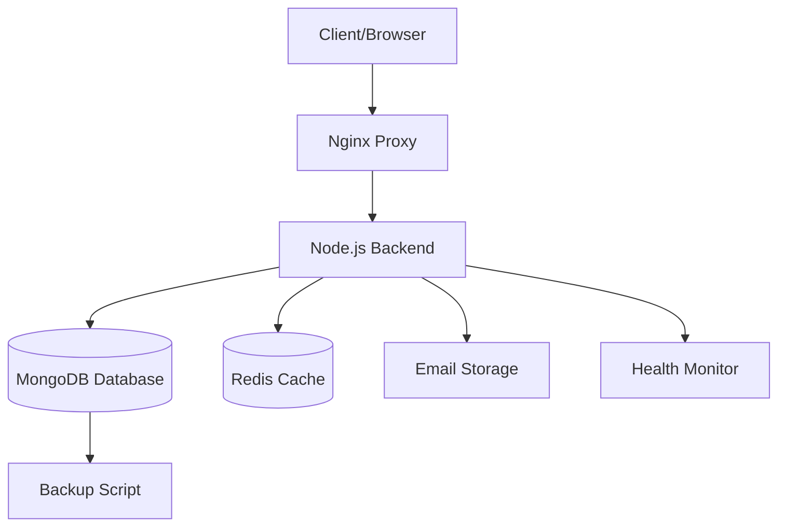

# EvalPoint Educational Platform - Docker Deployment Guide

## 🎓 Overview

This guide provides comprehensive instructions for deploying the EvalPoint Educational Platform using Docker containers. The platform is designed specifically for educational institutions with built-in compliance features for COPPA, FERPA, and GDPR regulations.

## 📋 Table of Contents

- [Prerequisites](#prerequisites)
- [Quick Start](#quick-start)
- [Development Environment](#development-environment)
- [Production Environment](#production-environment)
- [Environment Configuration](#environment-configuration)
- [Service Architecture](#service-architecture)
- [Health Monitoring](#health-monitoring)
- [Backup and Recovery](#backup-and-recovery)
- [Security Considerations](#security-considerations)
- [Troubleshooting](#troubleshooting)
- [Educational Compliance](#educational-compliance)
- [Maintenance](#maintenance)

## 🚀 Prerequisites

### System Requirements

- **Docker Engine**: 20.10.0 or later
- **Docker Compose**: 2.0.0 or later
- **Operating System**: Linux (recommended), macOS, or Windows with WSL2
- **Memory**: Minimum 4GB RAM, recommended 8GB+
- **Storage**: Minimum 20GB free space
- **Network**: Internet access for image downloads

### Software Dependencies

```bash
# Install Docker (Ubuntu/Debian)
curl -fsSL https://get.docker.com -o get-docker.sh
sh get-docker.sh

# Install Docker Compose
sudo curl -L "https://github.com/docker/compose/releases/download/v2.15.1/docker-compose-$(uname -s)-$(uname -m)" -o /usr/local/bin/docker-compose
sudo chmod +x /usr/local/bin/docker-compose

# Verify installation
docker --version
docker compose version
```

### Educational Platform Requirements

- SSL certificates (for production HTTPS)
- SMTP server configuration (for email notifications)
- Backup storage solution
- Monitoring infrastructure (optional)

## ⚡ Quick Start

### 1. Clone and Setup

```bash
# Clone the repository
git clone <repository-url>
cd evalpoint

# Copy environment configuration
cp .env.example .env

# Edit environment variables (IMPORTANT!)
nano .env
```

### 2. Configure Environment

Update the `.env` file with your specific configuration:

```env
# Critical Security Settings
JWT_SECRET=your_very_secure_jwt_secret_key_minimum_32_characters
MONGODB_PASSWORD=your_secure_mongodb_password
MONGODB_ROOT_PASSWORD=your_secure_root_password

# Platform Configuration
PLATFORM_NAME=Your Educational Platform
PLATFORM_URL=https://your-domain.com

# Educational Compliance
COPPA_COMPLIANCE=true
FERPA_COMPLIANCE=true
GDPR_COMPLIANCE=true
```

### 3. Deploy

```bash
# Quick production deployment
./docker/scripts/deploy.sh

# Or development deployment
./docker/scripts/deploy.sh --env development
```

### 4. Verify Deployment

```bash
# Check service status
docker compose ps

# Run health checks
./docker/scripts/health-check.sh

# View logs
docker compose logs -f
```

## 💻 Development Environment

### Development Deployment

The development environment includes additional tools and relaxed security for testing:

```bash
# Start development environment
docker compose -f docker-compose.yml -f docker-compose.dev.yml up -d

# Or use deployment script
./docker/scripts/deploy.sh --env development
```

### Development Features

- **Hot Reload**: Source code changes automatically restart the backend
- **MongoDB Express**: Web-based database administration at http://localhost:8081
- **Sample Data**: Pre-loaded test accounts and data
- **Relaxed Security**: Simplified passwords and disabled compliance checks
- **Debug Logging**: Verbose logging for development

### Test Accounts (Development Only)

| Role | Email | Password |
|------|-------|----------|
| Admin | admin@evalpoint.dev | admin123 |
| Teacher | teacher@evalpoint.dev | teacher123 |
| Student | student@evalpoint.dev | student123 |
| Parent | parent@evalpoint.dev | parent123 |

### Development URLs

- **Backend API**: http://localhost:5000
- **API Health**: http://localhost:5000/api/health
- **MongoDB Express**: http://localhost:8081 (admin/admin123)
- **API Documentation**: http://localhost:5000/api/docs

## 🏭 Production Environment

### Production Deployment

```bash
# Full production deployment
./docker/scripts/deploy.sh

# With SSL and monitoring
HTTPS_ENABLED=true ./docker/scripts/deploy.sh
```

### Production Configuration

```yaml
# docker-compose.yml includes:
services:
  mongodb:
    # Production MongoDB with authentication
    image: mongo:7.0.4
    environment:
      MONGO_INITDB_ROOT_USERNAME: admin
      MONGO_INITDB_ROOT_PASSWORD: ${MONGODB_ROOT_PASSWORD}
    volumes:
      - mongodb-data:/data/db
    
  backend:
    # Production backend with optimized build
    build:
      target: production
    environment:
      NODE_ENV: production
      JWT_SECRET: ${JWT_SECRET}
    
  nginx:
    # Reverse proxy with SSL termination
    image: nginx:1.25.3-alpine
    ports:
      - "80:80"
      - "443:443"
```

### SSL Configuration

1. **Obtain SSL Certificates**:
   ```bash
   # Using Let's Encrypt (recommended)
   certbot certonly --standalone -d your-domain.com
   
   # Copy certificates
   cp /etc/letsencrypt/live/your-domain.com/* ./docker/nginx/ssl/
   ```

2. **Configure Nginx**:
   ```nginx
   # ./docker/nginx/conf.d/default.conf
   server {
       listen 443 ssl;
       server_name your-domain.com;
       
       ssl_certificate /etc/nginx/ssl/fullchain.pem;
       ssl_certificate_key /etc/nginx/ssl/privkey.pem;
       
       location / {
           proxy_pass http://backend:5000;
       }
   }
   ```

## ⚙️ Environment Configuration

### Required Environment Variables

| Variable | Description | Example |
|----------|-------------|---------|
| `JWT_SECRET` | JWT signing secret (32+ chars) | `your_very_secure_secret_key_here` |
| `MONGODB_PASSWORD` | MongoDB user password | `secure_password_123` |
| `MONGODB_ROOT_PASSWORD` | MongoDB admin password | `admin_password_456` |
| `PLATFORM_NAME` | Your platform name | `Lincoln Elementary School` |
| `PLATFORM_URL` | Your platform URL | `https://learning.lincoln.edu` |

### Educational Compliance Variables

| Variable | Description | Default |
|----------|-------------|---------|
| `COPPA_COMPLIANCE` | Enable COPPA compliance | `true` |
| `FERPA_COMPLIANCE` | Enable FERPA compliance | `true` |
| `GDPR_COMPLIANCE` | Enable GDPR compliance | `true` |
| `STUDENT_DATA_RETENTION_DAYS` | Data retention period | `2555` (7 years) |

### Security Variables

| Variable | Description | Default |
|----------|-------------|---------|
| `BCRYPT_ROUNDS` | Password hashing rounds | `12` |
| `RATE_LIMIT_MAX_REQUESTS` | API rate limit | `100` |
| `SESSION_TIMEOUT` | Session timeout | `24h` |

## 🏗️ Service Architecture

### Container Services



### Service Details

| Service | Container | Port | Purpose |
|---------|-----------|------|---------|
| **Backend** | evalpoint-backend | 5000 | Authentication & API |
| **Database** | evalpoint-mongodb | 27017 | Data storage |
| **Cache** | evalpoint-redis | 6379 | Session management |
| **Proxy** | evalpoint-nginx | 80/443 | Load balancing & SSL |

### Volume Mapping

| Container Path | Host Path | Purpose |
|----------------|-----------|---------|
| `/data/db` | `./data/mongodb` | MongoDB data |
| `/app/logs` | `./logs/backend` | Application logs |
| `/app/data/emails` | `./data/emails` | Email storage |
| `/var/log/nginx` | `./logs/nginx` | Nginx logs |

## 🏥 Health Monitoring

### Built-in Health Checks

```bash
# Comprehensive health check
./docker/scripts/health-check.sh

# JSON output for monitoring systems
./docker/scripts/health-check.sh --json

# Verbose output
./docker/scripts/health-check.sh --verbose
```

### Health Check Endpoints

- **Backend Health**: `GET /api/health`
- **Database Health**: `GET /api/health/database`
- **Authentication Health**: `GET /api/auth/health`

### Health Check Response

```json
{
  "status": "healthy",
  "timestamp": "2024-01-15T10:30:00Z",
  "services": {
    "database": "healthy",
    "redis": "healthy",
    "email": "healthy"
  },
  "educational_compliance": {
    "coppa": "enabled",
    "ferpa": "enabled",
    "gdpr": "enabled"
  }
}
```

### Monitoring Integration

```bash
# Prometheus metrics (if enabled)
curl http://localhost:9090/metrics

# Custom monitoring script
#!/bin/bash
STATUS=$(./docker/scripts/health-check.sh --json | jq -r '.status')
if [ "$STATUS" != "0" ]; then
    # Send alert to monitoring system
    echo "EvalPoint platform health check failed" | mail -s "Alert" admin@school.edu
fi
```

## 💾 Backup and Recovery

### Automated Backups

```bash
# Full database backup
./docker/scripts/backup-database.sh full

# Incremental backup
./docker/scripts/backup-database.sh incremental

# Compliance data export
./docker/scripts/backup-database.sh compliance

# All backup types
./docker/scripts/backup-database.sh all
```

### Backup Schedule (Recommended)

```cron
# Daily incremental backup at 2 AM
0 2 * * * /path/to/evalpoint/docker/scripts/backup-database.sh incremental

# Weekly full backup on Sunday at 1 AM  
0 1 * * 0 /path/to/evalpoint/docker/scripts/backup-database.sh full

# Monthly compliance export on 1st at midnight
0 0 1 * * /path/to/evalpoint/docker/scripts/backup-database.sh compliance
```

### Backup Storage Structure

```
backups/
├── database/
│   ├── full/                    # Full database backups
│   ├── incremental/             # Incremental backups
│   ├── compliance/              # Compliance exports
│   └── exports/                 # Manual exports
├── configuration/               # Configuration backups
└── logs/                       # Backup logs
```

### Recovery Process

1. **Stop Services**:
   ```bash
   docker compose down
   ```

2. **Restore Database**:
   ```bash
   # Restore from backup
   docker run --rm -v ./backups:/backup mongo:7.0.4 \
     mongorestore --host mongodb:27017 /backup/evalpoint_full_20240115_020000
   ```

3. **Start Services**:
   ```bash
   docker compose up -d
   ./docker/scripts/health-check.sh
   ```

## 🔒 Security Considerations

### Production Security Checklist

- [ ] **Strong Passwords**: Use complex passwords for all services
- [ ] **SSL/TLS**: Enable HTTPS with valid certificates  
- [ ] **Firewall**: Configure firewall rules to restrict access
- [ ] **Updates**: Keep Docker images and host system updated
- [ ] **Backup Encryption**: Encrypt backup files
- [ ] **Access Control**: Implement role-based access control
- [ ] **Audit Logging**: Enable comprehensive audit logging
- [ ] **Network Security**: Use Docker networks for isolation

### Environment Security

```bash
# Set restrictive permissions on .env file
chmod 600 .env
chown root:root .env

# Use Docker secrets in production
echo "secure_password" | docker secret create mongodb_password -
```

### Network Security

```yaml
# docker-compose.yml network configuration
networks:
  evalpoint-network:
    driver: bridge
    ipam:
      config:
        - subnet: 172.20.0.0/16
```

### Container Security

```dockerfile
# Security best practices in Dockerfile
USER backend                    # Non-root user
RUN apk add --no-cache dumb-init # Proper init system
HEALTHCHECK --interval=30s      # Health monitoring
```

## 🎓 Educational Compliance

### COPPA (Children's Online Privacy Protection Act)

- **Age Verification**: Built-in date of birth validation
- **Parental Consent**: Parent email requirement for users under 13
- **Data Minimization**: Collect only necessary student information
- **Secure Deletion**: Automatic data deletion after retention period

```javascript
// COPPA compliance check in backend
if (userAge < 13 && !parentalConsent) {
  throw new Error('Parental consent required for users under 13');
}
```

### FERPA (Family Educational Rights and Privacy Act)

- **Access Controls**: Role-based access to educational records
- **Audit Logging**: Complete audit trail of data access
- **Data Security**: Encryption of educational data at rest and in transit
- **Retention Policy**: 7-year default retention for educational records

### GDPR (General Data Protection Regulation)

- **Data Protection**: Privacy by design implementation
- **User Rights**: Data portability and deletion capabilities
- **Consent Management**: Granular consent tracking
- **Data Processing**: Lawful basis documentation

### Compliance Monitoring

```bash
# Generate compliance report
./docker/scripts/backup-database.sh compliance

# Check audit logs
docker exec evalpoint-mongodb mongo evalpoint --eval "db.auditlogs.find().limit(10)"

# Export user data (GDPR request)
docker exec evalpoint-mongodb mongoexport \
  --db evalpoint --collection users \
  --query '{"email":"student@example.com"}' \
  --out /tmp/user_data_export.json
```

## 🛠️ Troubleshooting

### Common Issues

#### 1. Container Won't Start

```bash
# Check container logs
docker compose logs backend

# Check container status
docker compose ps

# Restart specific service
docker compose restart backend
```

#### 2. Database Connection Issues

```bash
# Test MongoDB connectivity
docker exec evalpoint-mongodb mongo --eval "db.adminCommand('ping')"

# Check MongoDB logs
docker compose logs mongodb

# Reset MongoDB container
docker compose stop mongodb
docker volume rm evalpoint-mongodb-data
docker compose up -d mongodb
```

#### 3. Email Storage Issues

```bash
# Check email storage directory
ls -la ./data/emails/

# Set proper permissions
sudo chown -R 1001:1001 ./data/emails/
chmod -R 755 ./data/emails/
```

#### 4. Performance Issues

```bash
# Check resource usage
docker stats

# Monitor backend performance
curl http://localhost:5000/api/health

# Check database performance
docker exec evalpoint-mongodb mongo --eval "db.runCommand({serverStatus: 1})"
```

### Debug Commands

```bash
# Enter backend container
docker exec -it evalpoint-backend /bin/sh

# View real-time logs
docker compose logs -f backend

# Check environment variables
docker exec evalpoint-backend env

# Test API endpoints
curl -H "Content-Type: application/json" \
  http://localhost:5000/api/health
```

### Log Locations

| Service | Log Location |
|---------|--------------|
| Backend | `./logs/backend/backend.log` |
| MongoDB | `./logs/mongodb/mongod.log` |
| Nginx | `./logs/nginx/access.log` |
| Deployment | `./logs/deployment.log` |
| Health Checks | `./logs/health-check.log` |

## 🔧 Maintenance

### Regular Maintenance Tasks

#### Daily
- [ ] Monitor health check status
- [ ] Review error logs
- [ ] Check disk space usage
- [ ] Verify backup completion

#### Weekly
- [ ] Update Docker images
- [ ] Clean up old logs
- [ ] Review security logs
- [ ] Test backup restoration

#### Monthly
- [ ] Update system packages
- [ ] Review and rotate secrets
- [ ] Conduct security audit
- [ ] Performance optimization review

### Maintenance Commands

```bash
# Update all services
docker compose pull
docker compose up -d

# Clean up Docker system
docker system prune -f

# Rotate logs
logrotate ./monitoring/logrotate.conf

# Security scan (if tools available)
docker scout cves evalpoint-backend:latest
```

### Scaling Considerations

```yaml
# Scale backend service
docker compose up -d --scale backend=3

# Load balancer configuration
nginx:
  depends_on:
    - backend
  environment:
    - BACKEND_REPLICAS=3
```

## 📞 Support and Resources

### Documentation
- [API Documentation](http://localhost:5000/api/docs)
- [Educational Compliance Guide](./EDUCATIONAL_COMPLIANCE.md)
- [Security Best Practices](./SECURITY.md)

### Community Support
- GitHub Issues: Report bugs and feature requests
- Educational Technology Forums: Community discussions
- Docker Community: Container-specific support

### Professional Support
For educational institutions requiring professional support, training, or custom implementations, contact the EvalPoint team.

---

## 🎉 Conclusion

The EvalPoint Educational Platform provides a robust, secure, and compliant foundation for educational technology deployments. With Docker containerization, you can easily deploy, scale, and maintain the platform while ensuring student data protection and regulatory compliance.

For additional help or questions, please refer to the troubleshooting section or contact support.

**Happy Learning! 🎓**